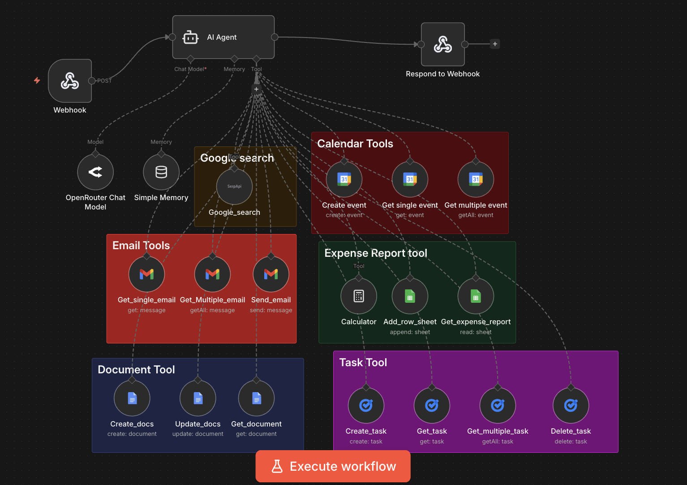

# 🤖 Personal AI Assistant — n8n + Streamlit

A multi-tool agentic AI assistant that understands natural language and autonomously
executes actions across your Google Workspace using n8n workflow orchestration.

> "Get all my meetings for tomorrow and email me a summary" — the assistant handles
> the full chain: fetches calendar events → composes summary → sends email. No manual steps.

---

## 🧠 Architecture

User (Streamlit UI) → Webhook → n8n AI Agent (OpenRouter LLM + Memory) → Tools → Response

The AI Agent autonomously decides which tools to call based on the user's intent,
executes them in the correct sequence, and returns a natural language response.

---

## 🛠️ What the Assistant Can Do

| Category | Capabilities |
|---|---|
| 📧 Email | Read emails, fetch multiple, send emails |
| 📅 Calendar | Create events, fetch single/multiple events |
| ✅ Tasks | Create, get, list, delete Google Tasks |
| 📝 Documents | Create, update, read Google Docs |
| 📊 Expenses | Log expenses to Google Sheets, generate reports |
| 🔍 Search | Google Search via SerpAPI |
| 🧮 Calculator | Arithmetic and expense calculations |

---

## ⚙️ Tech Stack

- **AI Agent** — n8n LangChain Agent node (OpenRouter LLM)
- **Memory** — n8n Window Buffer Memory (session-based, 50-message context)
- **Workflow Orchestration** — n8n
- **Frontend** — Python + Streamlit
- **Integrations** — Gmail, Google Calendar, Google Tasks, Google Docs,
  Google Sheets, SerpAPI
- **Transport** — Webhook (POST) + Respond to Webhook

---

## 🗺️ Workflow Overview




The workflow consists of a central AI Agent connected to 15+ tools across 6 categories.
The agent uses a system prompt with explicit tool-use rules to avoid redundant calls
and enforce correct execution sequences (e.g., always fetch calendar before sending email).

---

## 🚀 Setup

### Prerequisites
- n8n (local or cloud)
- Python 3.9+
- Google account with OAuth set up for Calendar, Gmail, Tasks, Docs, Sheets
- OpenRouter API key
- SerpAPI key

### 1. Import the workflow
In n8n: **New Workflow → Import from file** → select `workflow.json`

### 2. Configure credentials in n8n
Set up OAuth connections for:
- Gmail
- Google Calendar
- Google Tasks
- Google Docs
- Google Sheets
- OpenRouter
- SerpAPI

### 3. Update the Send Email node
In the `Send_email` node, replace `YOUR_EMAIL@gmail.com` with your actual email.

### 4. Activate the workflow
Toggle the workflow to **Active** in n8n.

### 5. Run the Streamlit frontend
```bash
pip install -r requirements.txt
streamlit run app.py
```

---

## 💬 Example Prompts

- *"What meetings do I have tomorrow? Send me a summary by email."*
- *"Create a task: Review PR by Friday."*
- *"Log an expense: ₹500 for groceries today."*
- *"Create a Google Doc titled 'Sprint Notes' and add today's date."*
- *"Search for the latest news on LLM agents."*

---

## 📁 Project Structure

```
n8n_Personal_Assistant/
├── app.py                          # Streamlit frontend
├── workflow.json # n8n workflow (import this)
├── requirements.txt
└── README.md
```
